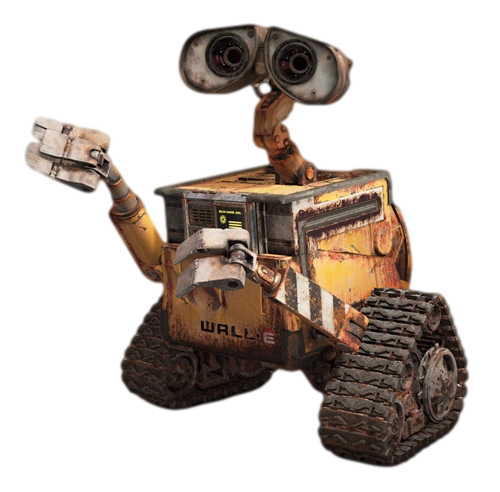

# Wall-EE

Welcome to the Wall-EE Mars Rover project! Our primary objective was to create a robust rover capable of precise control and reliable movement. Additionally, we aimed to establish seamless communication between the rover's onboard systems and a full stack web application. Our goal was to develop a sophisticated framework that facilitates data transmission and enables interaction with diverse physical hardware components.

## Command

The command module aims to build a fully functional cloud-based web app that interfaces with the control module. It allows the rover to carry out various functionalities, such as displaying its status and controlling the rover remotely during the autonomous exploration phase.

## Control/Integration

The control subsystem acts as the main convergence point for all other subsystems. It performs the integration of all subsystems, collecting data that can be manipulated or transferred to other systems within the ESP32 processor.

## Vision
The vision subsystem utilizes the terasIC D8M Digital Camera module to observe the environment and identify objects that could obstruct the rover's path. Obstacles can be multi-colored balls (aliens) or a striped piece of paper (a building). The vision subsystem determines the rover's approximate distance from the obstacles and its relative orientation, which is communicated to the command and control subsystems for safe avoidance and display on the rover's web interface.

## Radar
The radar subsystem is designed to locate underground alien infrastructure characterized by subsurface rotating fan blades. It uses the HB100 microwave motion sensor module to detect the relative speed of moving objects using the Doppler effect.

## Drive
The drive subsystem consists of two main sections: the optic sensor and the motor control system. These subsystems are mostly separate from each other, with the optic sensor data used in specific cases to control the motors.

## Energy

The energy sub-module optimizes the battery charging process using PV cells, buck-boost SMPSs, a relay module, and a battery. This sub-module assumes a stationary setup as the rover cannot accommodate this equipment during its journeys. The rover's journeys are limited to the proximity of its charging station, and the code ensures sufficient charge to return to the station.
